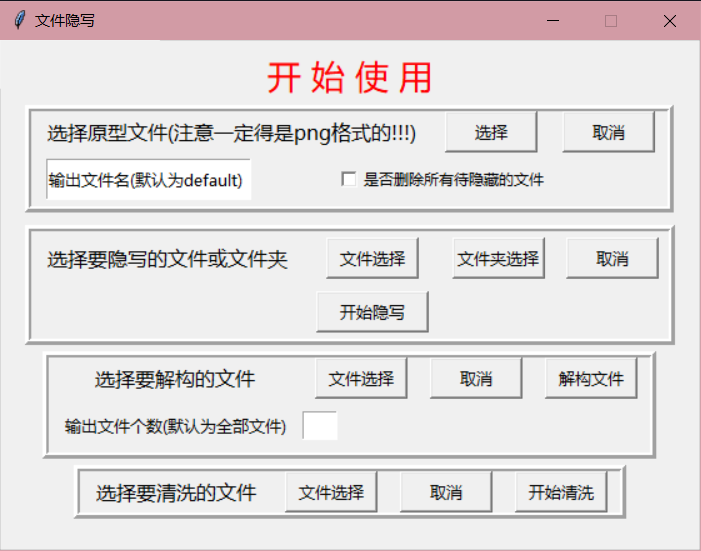

## [简介]

这是一个利用了一点png图片黑魔法的文件隐藏工具。

## [功能]

1. 文件隐藏: 支持将部分类型的文件(例如.jpg, .gif等格式)隐藏进选定的png图片, 支持单个文件以及单层文件夹内的所有内容。
2. png图片解构: 支持将含有隐藏文件的png图片内的隐藏文件解构并保存出来。
3. png图片清洗: 支持将含有隐藏文件的png图片进行清洗, 即清除掉其内的所有隐藏文件。

## [补充]

本软件旨在方便于将不想显示出来的文件秘密的隐藏掉, 并在想使用时解构出来。

由于纯是python编写故这里在处理内容众多的文件夹时效率会有明显下降, 后续也将考虑添加异步文件处理。

## [pyinstaller打包]

pyinstaller -i lock.ico run.py -w -F -n FileConceal