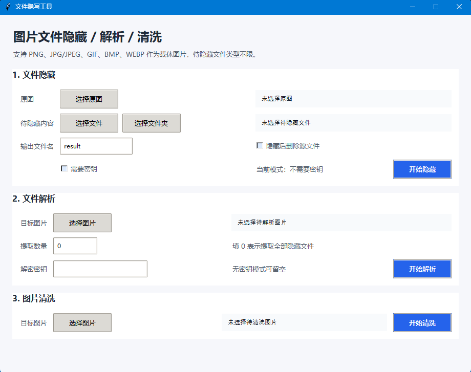

# File Conceal

一个用于将文件追加隐藏到图片末尾、并支持提取与清洗的桌面小工具，当前提供 `tkinter` 图形界面入口。



## 功能

1. 文件隐藏
   选择一张图片作为载体，将单个文件或单层目录中的全部文件追加写入图片末尾。

2. 文件提取
   从带有隐藏内容的图片中解析出文件，并输出到图片同级目录下的 `result` 文件夹。

3. 图片清洗
   删除图片中追加的隐藏数据，保留原始图片内容。

## 当前实现说明

- 支持作为载体图片的格式：`PNG`、`JPG/JPEG`、`GIF`、`BMP`、`WEBP`
- 待隐藏文件类型不限
- 单次可隐藏多个文件
- 提取时可指定提取数量，填 `0` 表示提取全部
- 隐藏时可选择在写入成功后删除源文件
- 若输出文件名与原图同名，仅在启用“隐藏后删除源文件”时允许原地替换

## 运行方式

安装 Python 依赖后直接启动：

```bash
python run.py
```

程序入口位于 [run.py](./run.py)，会启动图形界面。

## 使用流程

### 隐藏文件

1. 选择原图
2. 选择待隐藏的单个文件，或选择一个文件夹
3. 设置输出文件名
4. 按需勾选“隐藏后删除源文件”
5. 执行隐藏

输出图片会保存在原图所在目录，扩展名会自动保持和原图一致。

### 提取文件

1. 选择包含隐藏内容的图片
2. 输入提取数量，`0` 表示全部提取
3. 执行提取

提取结果会输出到目标图片同级目录下的 `result` 文件夹。

### 清洗图片

1. 选择包含隐藏内容的图片
2. 执行清洗

清洗会直接覆写目标图片，移除末尾隐藏数据。

## 核心逻辑

- 隐藏内容写入格式位于 [main.py](./main.py)
- 载体图片格式通过文件头识别，不只依赖扩展名
- 文件内容在写入前会经过自定义 Base64 编码后再封装
- 提取时会校验文件名并阻止覆盖已存在文件

## 打包

当前仓库中的打包命令如下：

```bash
pyinstaller -i lock.ico run.py -w -F -n FileConceal
```
